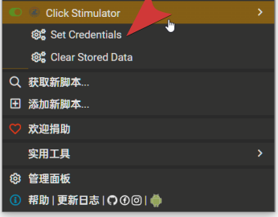

<h1 align='center'>js for tampermonkey</h1>

## Click Stimulator

### Intro
基于浏览器的账号密码自动填充功能，通过添加自启动任务，开机解锁后会自动打开认证界面，脚本自动填充账号密码，模拟点击登录按钮，实现自动登录。
初次使用需要在tampermonkey设置页面进行用户名密码填写，位置如下图。

### Usage

- 在`C:\Users\$USER\AppData\Roaming\Microsoft\Windows\Start Menu\Programs\Startup`文件夹下创建快捷方式，填入校园网认证地址，例如:`http://192.168.xx.xx:8080/`
- 命名，保存。（开机解锁后自动打开浏览器进入认证界面。）
- 浏览器安装插件：[Tampermonkey](https://www.tampermonkey.net/)，然后安装此脚本：[ClickStimulator](https://github.com/MegaSuite/js-tampermonkey/raw/master/ClickStimulator/ClickStimulator.user.js)

### Tips
- ~~记得打开浏览器的自动填充功能，否则无法自动填充账号密码。~~
- 目前已支持脚本层面的自动填充。`2024年11月24日更新`
- 登录认证之后，会自动关闭认证页面。`2023年11月15日更新`

## SimplyBili

### Intro
移除播放页残余灰色button
